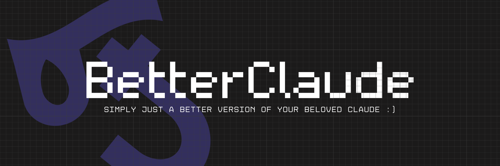
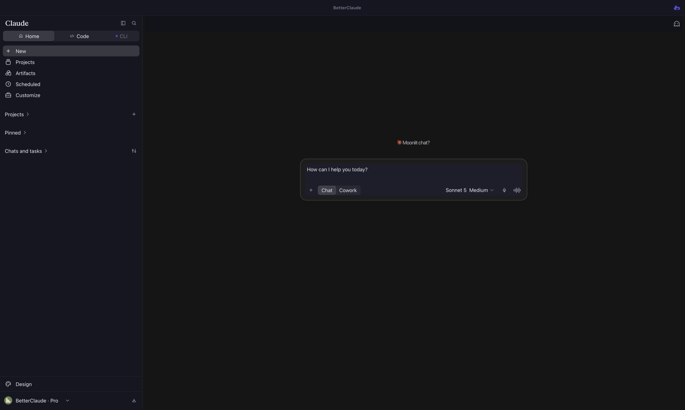
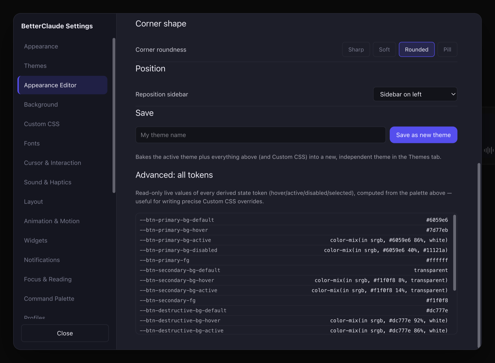
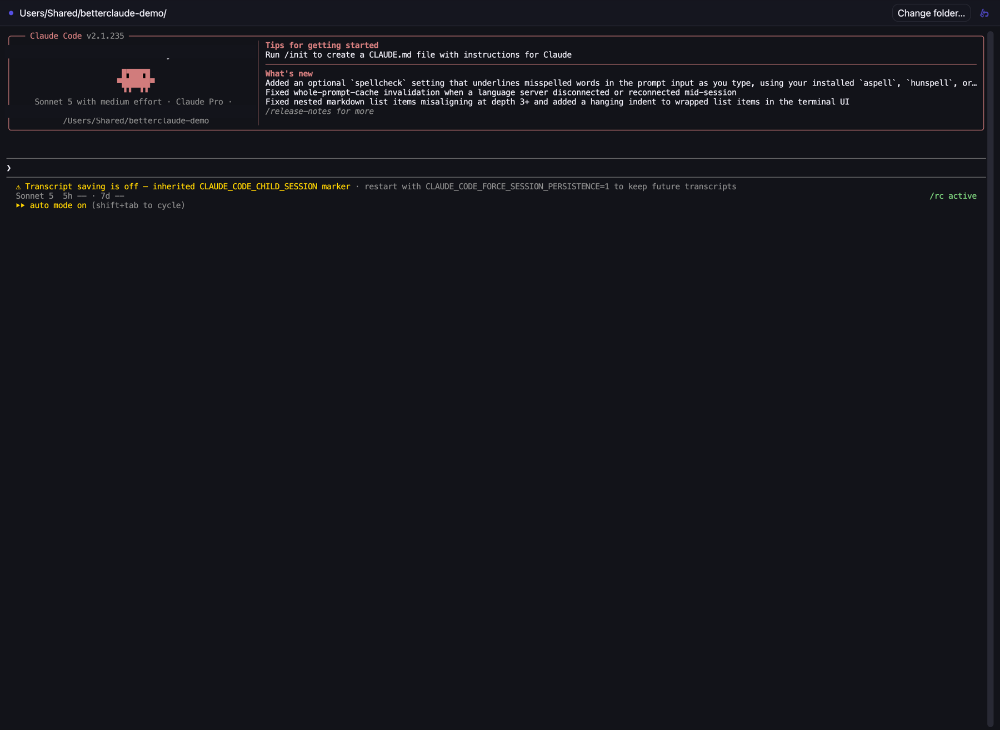
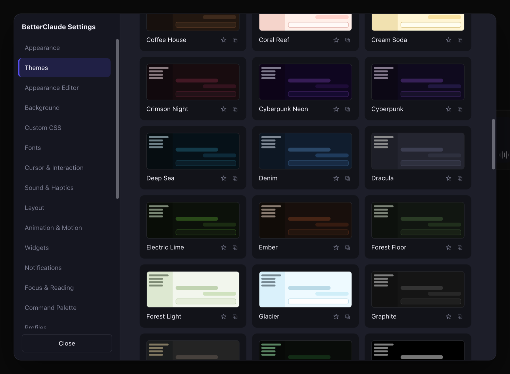
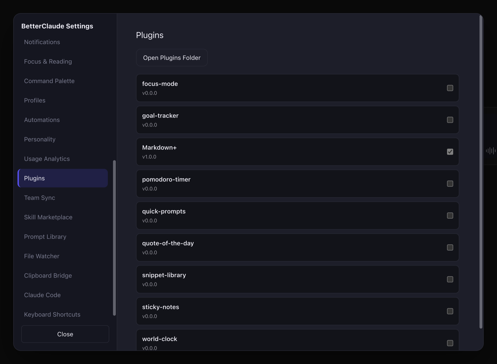

<div align="center">



<p>
  <a href="LICENSE"></a>
  
  
  
</p>
<p>
  
  
  
  
</p>

</div>

A BetterDiscord-style enhancement suite for Claude. Themes, plugins, and a pile of productivity tools layered on top of the Claude app you already use, without touching Anthropic's code or your login.

An Electron desktop app that loads the real claude.ai and injects a layer of UI and settings on top of it — not a fork, not a proxy, not a modified client. It's a window wrapped around the genuine site with an extra layer of chrome bolted on. Turn everything off in Settings and you're back to stock claude.ai instantly; no uninstall, no reset, no leftover state in your account. Nothing here ever touches your login, reads your conversations to phone them home, or ships a modified copy of Anthropic's code — every feature is either a local UI layer on top of the page or a genuinely local tool (an analytics database, a settings file, a spawned terminal) that never leaves your machine unless you explicitly point it at a relay or repo you control.



## Contents

- [How it actually works](#how-it-actually-works)
- [Productivity modules](#productivity-modules)
- [Themes & the Appearance Editor](#themes--the-appearance-editor)
- [Plugins](#plugins)
- [Buddies](#buddies)
- [The little stuff](#the-little-stuff)
- [Settings, storage & privacy](#settings-storage--privacy)
- [Building it yourself](#building-it-yourself)
- [Releasing & auto-update](#releasing--auto-update)
- [Contributing](#contributing)

## How it actually works

BetterClaude is an Electron `BrowserWindow` pointed at the real `claude.ai`, with a `core/` bundle injected into the page as a preload/content layer — the same general shape as a browser extension, just packaged as a standalone desktop app instead of living inside Chrome. Concretely:

- `core/claude-dom.js` reads and reacts to claude.ai's actual DOM (message list, composer, sidebar) rather than replacing it, so the real site keeps rendering your real conversations.
- `core/theme-engine.js` and `core/tokens.js` apply theming through CSS custom properties (`--bc-*` variables) laid on top of claude.ai's own styles, not a hard fork of its stylesheet — which is also why themes restyle *everything* injected (including the embedded Claude Code terminal) live, with no reload.
- `core/plugin-loader.js` loads `*.claudeplugin.js` files (built-in and yours) into that same page context, sandboxed enough that a broken plugin doesn't take the whole app down.
- `electron/main.js` is the only process with real OS access — spawning the Claude Code CLI, watching files, talking to SQLite, hitting the GitHub API. The renderer talks to it exclusively through a `contextBridge` (`electron/preload.js` / `electron/code-preload.js`), with `nodeIntegration` off, so page content never gets a raw path to Node or the filesystem.
- Every one of the modules below is **off unless you turn it on**. The app's baseline state, before you touch a single toggle, is "claude.ai with better themes." Nothing phones home, collects telemetry, or requires an account beyond the claude.ai login you already have.

## Productivity modules

Nine productivity modules, each independently toggleable from its own section in Settings and persisted through the same `electron-store`-backed settings file as everything else. Short version first, then what's actually happening under the hood for each.

| Module | Off by default? |
| --- | --- |
| Skill Marketplace | Yes |
| Prompt Library | No |
| Native File Watcher Sync | No |
| Team/Shared Plugin Sync | Yes |
| Usage Analytics Dashboard | Yes |
| Cross-Device Clipboard Bridge | Yes |
| Smart Notification Digest | Yes |
| Command Palette (Cmd/Ctrl+K) | No |
| Embedded Claude Code window | No |

**Skill Marketplace** (Settings → Skill Marketplace) — browses public GitHub repos tagged `claude-skill` through the GitHub Search API; add your own personal access token in Settings if you want a higher rate limit than the anonymous API gives you. "Install" on a result downloads its `SKILL.md` plus any bundled assets straight into `userData/skills/<id>/` on disk. It stops there on purpose: claude.ai has no public API for registering a Skill programmatically, so BetterClaude can't (and doesn't try to) upload it for you — you still take the last step yourself via claude.ai → Settings → Capabilities. What it actually buys you is not hand-cloning repos and hunting for the right file; **updating** an installed skill works the same way, re-running "Install" over an existing id re-downloads and overwrites that folder's contents from the repo's current `main`, so refreshing a skill you already have is the same one click as installing it fresh. The catalog UI lives in `core/skill-marketplace.js` and opens from Cmd/Ctrl+K → "Open Skill Marketplace"; the download/search logic is a set of `skills:*` IPC handlers in `electron/main.js`.

**Prompt Library** (Settings → Prompt Library) — a saved-prompt manager with `{{variable}}` placeholders, including two that auto-fill: `{{clipboard}}` and `{{selection}}`. Open the picker overlay (`core/prompt-picker.js`) with Cmd/Ctrl+Shift+P, from the Command Palette, or bind any individual prompt to its own OS-wide global shortcut — that registration goes through Electron's `globalShortcut` API via `registerPromptShortcuts` in `electron/main.js`, so it fires even when BetterClaude isn't the focused window. Prompts import/export as JSON and merge by id on import, so pulling in someone else's shared library never silently wipes your own.

**Native File Watcher Sync** (Settings → File Watcher) — points at a local file, watches it with `chokidar` in the main process, and keeps a labeled fenced-code-block copy of its contents synced into the composer (`core/file-sync-indicator.js`). This deliberately does **not** fake claude.ai's real file-upload button — the synced content is genuine inserted text, not a spoofed attachment, so what Claude sees is exactly what's in your composer box. "Auto-reattach" only ever finds and replaces that same block inside a message you haven't sent yet; once a message is sent, a file that changes afterward is just flagged stale with a one-click re-insert rather than silently rewriting something already delivered.

**Team/Shared Plugin Sync** (Settings → Team Sync) — points at a git repo containing shared `*.claudeplugin.js` and/or theme `*.css` files. `electron/team-sync.js` shells out to your system's `git` binary (clone once, then `fetch` + hard-reset on every later sync — no bundled JS git library) into `userData/team-sync/<repo-slug>/`, then copies the matched files into the exact same `userData/plugins` / `userData/themes` folders a manually-added plugin or theme already lives in, so nothing about how they load is special-cased. You can pull manually with "Sync now" or set an interval. Conflict handling is hash-based: a per-file manifest remembers what was last applied, so a sync can distinguish "the repo changed" from "you edited your local copy." A file where **both** changed since the last sync surfaces as a conflict with an inline diff and a Keep mine / Take theirs choice; anything non-conflicting applies automatically when "Auto-apply" is on.

**Usage Analytics Dashboard** (Settings → Usage Analytics) — a most-used-plugins chart with a date-range picker (presets plus a custom range) and CSV/PNG export, built entirely from plugin-activity events logged locally once you turn it on. `electron/analytics-db.js` stores those events in a genuine SQLite database (via `sql.js`, SQLite compiled to WebAssembly) at `userData/analytics.sqlite` — WASM instead of a native addon like `better-sqlite3` specifically so there's no per-platform native rebuild step, and so the same engine could run inside a browser extension down the line. The charts themselves are hand-rolled Canvas 2D (`core/analytics-charts.js`), no charting library dependency at all. No conversation content is ever read or recorded here, and nothing is ever transmitted anywhere; "Clear all data" deletes the local database file outright. Open the dashboard from Cmd/Ctrl+K → "Open Usage Analytics" or Settings → Usage Analytics → "Open Dashboard."

**Cross-Device Clipboard Bridge** (Settings → Clipboard Bridge) — copy something on one device and it's paste-ready on another within a short TTL. It syncs through a relay *you* point it at: `scripts/clipboard-relay-server.js` is a minimal, self-hostable reference implementation (`npm run clipboard-relay`, or `node scripts/clipboard-relay-server.js --port 8787`), and any HTTP endpoint implementing the same tiny `POST /put` / `GET /pull` / `GET /health` protocol works as a drop-in replacement. Everything is end-to-end encrypted client-side before it ever leaves your machine — `core/clipboard-bridge.js` derives an AES-GCM key from a shared passphrase you set via PBKDF2, so the relay only ever sees ciphertext plus a one-way channel id, never plaintext and never the passphrase itself. Nothing syncs until both a relay URL and a passphrase are configured and the toggle is on; Settings → Clipboard Bridge always shows a live connection state (Disconnected / Connecting / Connected / Error), and every item that syncs fires a notification, so it's never silently reading or writing your clipboard in the background. Polling, encryption, and OS clipboard read/write all happen in `electron/main.js`, mirroring the same main-process-only pattern as File Watcher Sync.

**Smart Notification Digest** (Settings → Notifications → Smart Notification Digest) — batches routine background-completion notifications (a Team Sync file applied, a clipboard item synced, a skill finished installing, …) into one periodic native OS notification instead of firing a toast per event. Failures are deliberately exempt from batching: `electron/preload.js`'s `notify()` has an `urgent` flag that shows immediately as both an in-page toast and a native notification regardless of digest state — used, for example, when a background Team Sync auto-sync fails. The digest only ever delays "it worked" noise; it never delays or hides an error. Native delivery itself is a small `Notification.isSupported()`-guarded `notifications:show-native` IPC handler in `electron/main.js`.

**Command Palette** (Cmd/Ctrl+K, Settings → Command Palette) — the connective tissue across everything above, built last on purpose so there was a settled surface area to index. One fuzzy-search overlay covers app actions, every settings page (jumping straight to the right section via `SettingsPanel.openSection`), installed plugins (toggle on/off inline), Prompt Library entries (insert directly), and both installed and cached-marketplace Skills. Matching runs through a small hand-rolled fuzzy subsequence scorer (`core/command-palette.js`'s `fuzzyScore`) rather than a plain substring filter, so abbreviations and scattered-letter queries still rank sensibly instead of just failing to match; each result carries a small group tag — Action / Settings / Plugins / Prompts / Skills / Analytics — so you can tell at a glance what kind of thing you're about to trigger.

**Embedded Claude Code window** (tray → "Open Claude Code", File → "Open Claude Code" / "Open Claude Code in Folder…", Cmd/Ctrl+Shift+K, or launched with `--code`) — opens your real, already-installed Claude Code CLI inside a BetterClaude-owned window instead of handing you off to Terminal.app. The relationship is the same one `lazygit` has with `git`: `electron/claude-cli.js` resolves the `claude` executable the way a login shell would (PATH first, then the usual user-level install locations, because a Dock-launched `.app` inherits a stripped-down PATH that wouldn't otherwise find it) and spawns it in a real pseudo-terminal via `node-pty`; `ui/code-window/terminal.js` renders that pty with `xterm.js`. Nothing about the CLI itself is reimplemented, wrapped, or intercepted — it is the authentic binary, and BetterClaude supplies only the window chrome around it. Because the terminal reads the same `--bc-*` theme variables as the rest of the app, switching your active theme restyles it live without disturbing the running session, and the title bar's settings button opens the real settings panel scoped down to just the appearance sections (`electron/code-preload.js`'s `CODE_WINDOW_SECTIONS`). The renderer runs with `nodeIntegration: false`: every byte of pty output crosses exactly one `contextBridge` surface, the only thing ever written to the child process's stdin is your own keystrokes forwarded verbatim, terminal output is never parsed to auto-trigger anything, and no auth token, session file, or credential is ever read anywhere along that path. Closing the window kills the child process. The spawn logic itself is a compliant port from the standalone `BETTERCLAUDE OFFICIAL` terminal-wrapper project, not a cross-import between the two.





Full technical detail on every module above — exact file paths, IPC handler names, and what's persisted where — lives in [docs/DESKTOP-APP.md](docs/DESKTOP-APP.md).

## Themes & the Appearance Editor

80 built-in themes ship in `themes/*.css`, each a plain, readable stylesheet built on the same `--bc-*` token set, so any of them can be copied and tweaked as a starting point for your own. On top of picking one outright, the Appearance Editor lets you hand-tune corner radius, spacing scale, font family, and every derived hover/active/disabled color state without writing CSS yourself — and for anyone who wants to go further than the editor's controls allow, there's a raw Custom CSS box underneath that layers directly on top of whatever theme is currently active. Whatever you land on, editor tweaks and all, saves as your own named theme alongside the built-in 80.



The full built-in list, grouped roughly by mood rather than the alphabetical order they ship in:

- **Editor-tunable defaults & neutrals** — betterclaude-default, graphite, slate-mono, zinc, stone, mono-black, mono-white, porcelain, pearl, linen, quiet-sand
- **Dark, high-contrast & terminal-flavored** — dracula, nord, nordic, tokyo-night, gruvbox-dark, one-dark, monokai, night-owl, obsidian, hacker-green, neon-terminal, high-contrast, high-contrast-dark, high-contrast-light, crimson-night
- **Vibrant & neon** — cyberpunk, cyberpunk-neon, synthwave, vapor, vaporwave, infrared, electric-lime, secret-rainbow
- **Cool & aquatic** — arctic-glass, arctic-light, glacier, iceberg, deep-sea, ocean-abyss, oceanic, cobalt, denim, blueprint, mint-frost, raincloud
- **Warm & earthy** — bamboo, moss, forest-floor, forest-light, matcha, pistachio, sage-paper, walnut, coffee-house, ember, tangerine, honeycomb, warm-dusk, solar-dusk
- **Soft & pastel** — sakura-blossom, cherry-cola, coral-reef, cream-soda, rose-glass, rose-quartz, lavender-mist, orchid, plum-velvet, candy, aubergine
- **Reading & paper-like** — sepia-study, newspaper, catppuccin-mocha, aurora-ink, midnight-copper, midnight-violet, solarized-light, volcanic, clay, honeycomb

Import a theme from a URL or a local file if someone shares one with you, or hit "Surprise Me" to shuffle through the full set if you'd rather not pick.

## Plugins

Nine plugins ship in the box, each a plain `*.claudeplugin.js` file in `plugins/` you can open, read, edit, or replace outright — there's no compiled or minified plugin format to fight with, just a small manifest-plus-script convention that the built-in ones all follow.

| Plugin | What it does |
| --- | --- |
| Focus Mode | Strips away everything on the page that isn't the active conversation — sidebar, nav chrome, the works — for a distraction-free reading/writing surface you can toggle in and out of instantly. |
| Goal Tracker | A simple running checklist of goals pinned to the sidebar, so whatever you're actually trying to get done stays visible while you work instead of living in a separate app. |
| Markdown Plus | Extra Markdown rendering on top of claude.ai's own, in both the composer while you're typing and in Claude's replies once they land. |
| Pomodoro Timer | A small always-visible timer widget in the corner of the app for running focus/break cycles alongside a conversation. |
| Quick Prompts | One-click buttons for the handful of prompts you type constantly, so they're a click away instead of a copy-paste from somewhere else. |
| Quote of the Day | A rotating quote on the home screen — pure flavor, no functional dependency on anything else. |
| Snippet Library | Reusable text snippets you can drop straight into the composer, separate from the full Prompt Library module for shorter, more disposable bits of text. |
| Sticky Notes | Freeform notes that stay pinned to the app across sessions, for the stuff that doesn't belong in a conversation but you don't want to lose either. |
| World Clock | A small multi-timezone clock widget, useful if you're coordinating with Claude (or people) across time zones. |



`core/plugin-loader.js` is what actually loads these — built-in and custom alike, from the same `userData/plugins` directory, with no special-casing for the nine that ship by default. "Open Plugins Folder" in Settings takes you straight there in Finder/Explorer, and dropping in your own `*.claudeplugin.js` file is enough for it to show up in the plugin list on next launch (or a manual reload from Settings), ready to toggle on like any other. This is also exactly the mechanism Team/Shared Plugin Sync writes into, so a plugin distributed through a synced team repo and one you wrote yourself locally are indistinguishable to the loader.

## Buddies

Small animated companions that live in the corner of the app while you work, defined in `buddies/`: Astronaut, Detective, Scuba Diver, and Spartan. Each one has its own distinct typing, thinking, running, and flying animation state, driven by `core/companion.js` and `core/buddies.js` watching what's actually happening in the conversation — so the buddy visibly reacts (moves, changes pose) as Claude goes from idle to composing a reply and back, rather than just looping the same idle animation the whole time. Pick one, or none, from Settings; only one is active at a time.


## The little stuff

Things that don't need their own top-level section but are worth knowing about:

- **Snake, while you wait.** `ui/mini-game/snake.js` pops a small Snake board into the corner whenever Claude is actively generating a response, and it disappears on its own the moment the answer lands — no manual dismiss needed. There's a setting for how long a response has to run before the board shows up, so quick replies never trigger it in the first place.
- **Sound effects** for the moments that deserve them (`core/sound-engine.js`) — response complete, notification, that kind of thing — all individually optional and off entirely if you'd rather have silence.
- **Motion and interaction touches** scattered through the UI (`core/interaction-fx.js` for click/hover feedback, `core/motion-fx.js` for transitions), the kind of detail that's easy to miss on first look and hard to unsee once you notice it's there.
- **A weather widget** (`core/weather.js`), if you want one more small thing living in the corner of your screen alongside everything else.
- **A built-in diff viewer** (`core/diff-viewer.js`) for anything that needs a real side-by-side comparison, rather than reading a diff as flat text in a message.
- **Overlay occlusion handling** (`core/overlay-occlusion.js`) — BetterClaude's own overlays (Command Palette, dashboards, pickers) automatically suspend themselves when claude.ai opens one of its own modals on top, and vice versa, so the two layers never fight for the same click or stack incorrectly on top of each other.

## Settings, storage & privacy

Every module's on/off state, and every setting inside it, is persisted through a single `electron-store`-backed JSON settings file — there's no scattered config across a dozen files, and no setting requires restarting the app to take effect. As a rule across every module documented above:

- **Nothing is on by default that reaches outside your machine.** Skill Marketplace, Team Sync, and Clipboard Bridge — the three modules that talk to something other than claude.ai (GitHub, a git remote, a relay server) — all ship **off**, and stay off until you both enable them and supply the endpoint (repo URL, relay URL) yourself.
- **Local data stays local data.** Usage Analytics writes to a SQLite file under `userData/`; Skills, plugins, and themes write to plain files under the same `userData/` tree. None of it is uploaded anywhere by BetterClaude itself.
- **Anything that does leave the machine is opt-in and end-to-end scoped to what you asked for** — Clipboard Bridge encrypts client-side before a relay ever sees a byte; Skill Marketplace only ever reads public GitHub search results and repo contents you explicitly install; Team Sync only ever pulls from the exact git remote you configured.
- Turning off every module returns the app to a plain themed wrapper around claude.ai; there's no "hidden" always-on component operating underneath the visible toggles.

## Building it yourself

```bash
npm install
npm run dev      # build the core bundle and launch Electron in dev mode
npm start        # build the core bundle and launch Electron (non-dev)
```

Packaged builds go through [electron-builder](https://www.electron.build/), configured in the `build` field of `package.json`:

```bash
npm run build:mac         # macOS: arm64 + x64, .dmg + .zip
npm run build:mac:arm64   # macOS: arm64 only
npm run build:mac:intel   # macOS: x64 only
npm run build:win         # Windows: x64 NSIS installer (.exe)
npm run build:all         # everything above in one run
```

Signed, notarized macOS output (`.dmg`/`.zip`) requires building on an actual Mac — Apple's build tools (`hdiutil`, `codesign`, notarization) aren't available on Linux or Windows. The Windows NSIS installer, by contrast, builds fine cross-platform from any host since electron-builder bundles its own NSIS tooling (no Wine needed).

Every build script runs `build:core` first (the esbuild bundle step), so packaged output always ships whatever's currently in `build/*.bundle.js` — you never get a stale bundle in a fresh package. Output lands in `dist/`:

- `dist/BetterClaude-<version>-arm64.dmg` + `.zip` — macOS Apple Silicon
- `dist/BetterClaude-<version>-x64.dmg` + `.zip` — macOS Intel
- `dist/BetterClaude Setup <version>.exe` — Windows installer (NSIS, lets the user pick an install directory, adds desktop + Start Menu shortcuts)

These builds are currently **unsigned** — there's no Apple Developer ID or Windows code-signing certificate wired up yet. In practice: macOS shows a Gatekeeper "app is damaged / unidentified developer" warning (workaround: right-click → Open), and Windows shows a SmartScreen "Windows protected your PC" prompt (workaround: "More info" → "Run anyway"). Neither is a bug so much as an unfinished distribution step — add signing identities to the `mac`/`win` build config plus the matching `CSC_LINK`/`CSC_KEY_PASSWORD` env vars (or the Windows equivalent) before shipping this to people who shouldn't have to click through OS warnings.

## Releasing & auto-update

Updates are served straight from **GitHub Releases** — there's no backend server involved. `build.publish` in `package.json` points `electron-updater` at the repo, electron-builder writes a `latest-mac.yml` / `latest.yml` update feed next to the release artifacts, and the running app polls that feed directly.

In the app itself: it checks for updates ~5 seconds after launch (skippable via Settings → Appearance → Updates), plus on demand from that same settings section or Help → Check for Updates…. Nothing downloads automatically and nothing installs on quit — both steps always require an explicit click. An available update raises a dismissible bottom-right banner; "Later" suppresses just that one version, and the next release surfaces normally. Background check failures stay silent (visible in Settings if you go looking), while a hand-triggered check always surfaces an error with an "Open Releases" fallback button.

**Signing directly limits how far auto-update can go today:** on macOS, `electron-updater` verifies the downloaded build's code signature against the running app before installing, so an unsigned build downloads fine and then fails to install with a signature error — macOS auto-update effectively requires a Developer ID Application certificate plus notarization, and until that's configured, macOS users update by grabbing the new `.dmg` manually (which is exactly why every update-check failure path offers that "Open Releases" button). Windows auto-update, by contrast, **does** work fully unsigned via NSIS — the only cost is a SmartScreen "unrecognized publisher" prompt on install until the build accumulates reputation or gets signed.

Cutting a release is a manual sequence today (no CI workflow yet): bump the version with `npm version patch|minor|major` (refuses to run on a dirty tree, and writes both `package.json` and the matching git tag), push the commit and tag (`git push && git push --tags` — the tag **must** be `vX.Y.Z`, since electron-builder derives the release from it and electron-updater matches on it), then build and publish every target in one step with `GH_TOKEN=<token with repo scope> npm run build:core && npx electron-builder --mac --arm64 --x64 --win --x64 --publish always`. The resulting release is created as a **draft** — the changelog you add to its body before publishing is exactly what the in-app "what's new" banner shows, stripped to plain text and capped at 160 characters.

## Contributing

Issues and pull requests are welcome. If you're adding a plugin or a theme, look at an existing one in `plugins/` or `themes/` first — the format for both is small enough to copy from directly rather than build up from scratch.

## License

MIT, see [LICENSE](LICENSE).
