<div align="center">

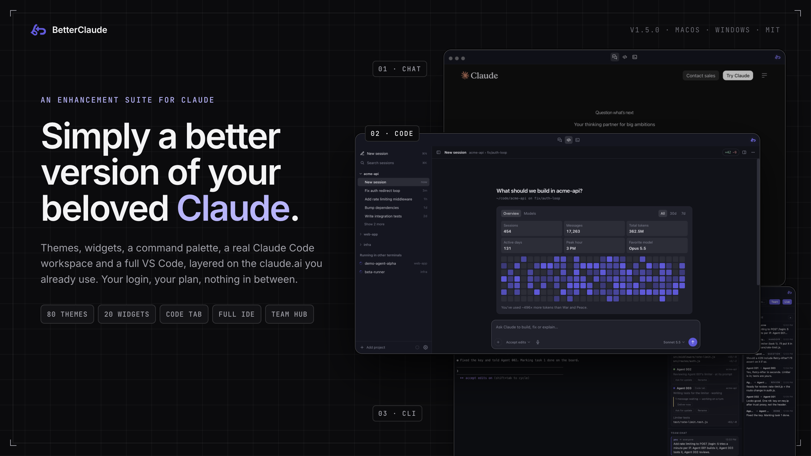

<p>
  <a href="https://github.com/ara-mkr/BetterClaude/releases/latest"></a>
  
  <a href="LICENSE"></a>
  
</p>
<p>
  
  
  
  
  
  
</p>

<h3>
  <a href="#-quick-install">Install</a>
  <span>&nbsp;·&nbsp;</span>
  <a href="#-at-a-glance">Features</a>
  <span>&nbsp;·&nbsp;</span>
  <a href="#02--the-code-tab">Code tab</a>
  <span>&nbsp;·&nbsp;</span>
  <a href="#07--themes">Themes</a>
  <span>&nbsp;·&nbsp;</span>
  <a href="#11--privacy">Privacy</a>
  <span>&nbsp;·&nbsp;</span>
  <a href="#-building-from-source">Build</a>
</h3>

</div>

<br>

**BetterClaude** is a BetterDiscord-style enhancement suite for Claude: a desktop app that loads the **real claude.ai** and layers themes, widgets, a command palette, a Claude Code workspace and a full VS Code on top of it.

It is not a fork, a proxy or a modified client. It's a window wrapped around the genuine site, plus a layer of chrome. Turn everything off in Settings and you're back to stock claude.ai instantly, with no uninstall, no reset, and nothing left behind in your account. It never touches your login, never reads your conversations to send them anywhere, and never ships a modified copy of Anthropic's code. Every feature is either a local UI layer on top of the page or a genuinely local tool (a settings file, a spawned terminal, Claude Code's own files) that stays on your machine unless you point it at a repo or relay you control.

> [!NOTE]
> **Actively developed.** BetterClaude ships on a steady cadence, and because it sits on top of claude.ai's fast-moving UI, the occasional rough edge is expected. If you hit one, [open an issue](https://github.com/ara-mkr/BetterClaude/issues) and the fix goes out with the next release.

<br>

## ✦ At a glance

<table>
<tr>
<td width="50%" valign="top">

**🎨 Make it yours**
- **80 themes**, each a plain readable stylesheet, switched live with no reload
- **Appearance Editor** for every colour, size and corner, no CSS required
- **Custom CSS**, fonts, cursor effects, sounds, motion, layout and density
- **20 dock widgets**: Pomodoro, Git Status, Plan Usage, Context Gauge and more

</td>
<td width="50%" valign="top">

**⌨️ Move faster**
- **Command palette** (⌘K) over actions, settings, plugins, prompts and skills
- **Prompt library** with `{{variables}}` and OS-wide shortcuts per prompt
- **Skill marketplace**, file watcher sync, encrypted clipboard bridge
- **Profiles** and **automations** to switch whole setups in one click

</td>
</tr>
<tr>
<td width="50%" valign="top">

**🧑‍💻 Code with Claude**
- **Code tab**: a real Claude Code session laid out like an IDE, on your plan
- **Full IDE** (⌘⌥I): VSCodium's workbench with Open VSX extensions, wired to the chat
- **CLI tab**: the authentic `claude` binary in a real terminal, tabbed
- **Free-model failover** through OpenRouter or a local Ollama

</td>
<td width="50%" valign="top">

**🤝 Work as a team**
- **Team Hub**: several Claude Code agents sharing one folder-local hub
- **Live Wire**: every message and handoff in the order it really happened
- **Team Sync**: shared plugins and themes from a git repo
- **Session Bundles**: export a session's transcript and diff, secrets redacted

</td>
</tr>
</table>

<br>

## ⚡ Quick install

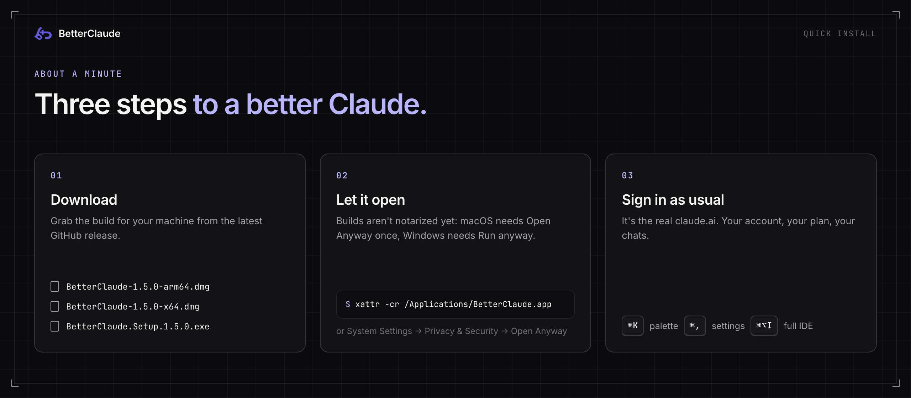

**Fastest: one command, no security prompts.** It downloads the latest release straight from GitHub and installs it. Run the same command again any time to update.

macOS (Terminal):

```bash
curl -fsSL https://raw.githubusercontent.com/ara-mkr/betterclaude/main/scripts/install.sh | bash
```

Windows (PowerShell):

```powershell
irm https://raw.githubusercontent.com/ara-mkr/betterclaude/main/scripts/install.ps1 | iex
```

Files a browser downloads get flagged as "from the internet", and that flag is what makes macOS and Windows ask "are you sure?" about apps that aren't signed with a paid developer certificate. Files these commands fetch aren't flagged, so BetterClaude simply opens. Both scripts are short and readable: [install.sh](scripts/install.sh), [install.ps1](scripts/install.ps1).

**Or download it yourself.**

**1. Download** the build for your machine from the **[latest release](https://github.com/ara-mkr/BetterClaude/releases/latest)**. That's the only place installers are published: no App Store build, no mirrors.

| File | Platform |
| :--- | :--- |
| `BetterClaude-<version>-arm64.dmg` | macOS, Apple Silicon (M-series) |
| `BetterClaude-<version>-x64.dmg` | macOS, Intel |
| `BetterClaude.Setup.<version>.exe` | Windows 10 / 11, 64-bit |

Each release also carries `.zip` copies of the macOS builds if you'd rather skip the DMG.

**2. Let it open.** The builds aren't notarized yet (that needs Apple's paid Developer Program), so the first launch needs one extra click.

<details>
<summary><b>macOS</b>: <i>"BetterClaude not opened, Apple could not verify it"</i></summary>
<br>

That's Gatekeeper, not a broken file. The one-time way past it:

1. Drag BetterClaude to `/Applications`, try to open it, and click **Done** on the dialog (don't move it to the Trash).
2. Open **System Settings → Privacy & Security**, scroll to the Security section, and click **Open Anyway** next to the BetterClaude message. Authenticate, then click **Open**.
3. That's it. It opens normally from then on.

Or skip the settings page from a terminal:

```bash
xattr -cr /Applications/BetterClaude.app
```

</details>

<details>
<summary><b>Windows</b>: <i>"Windows protected your PC"</i></summary>
<br>

Click **More info → Run anyway** on the SmartScreen prompt. After that the app checks this repo's Releases on launch and offers updates in-app. Windows updates in place. On macOS, re-run the install command (or download the new DMG) to update until the build gets a Developer ID certificate.

</details>

**3. Sign in as usual.** It's the real claude.ai, so it's your account, your plan and your chats. Then press **⌘K** (Ctrl+K on Windows) and start exploring.

### What you need for each part

| Feature | Needs |
| :--- | :--- |
| Themes, widgets, palette, prompts, settings | Nothing extra. Works out of the box. |
| **Code tab** and **CLI tab** | The [Claude Code CLI](https://docs.claude.com/en/docs/claude-code) installed and signed in (`claude` on your PATH) |
| **Commit & PR** in the Code tab | `git`, plus the GitHub CLI (`gh`) for opening pull requests |
| **Full IDE** | A one-time, opt-in download of about 131 MB, offered in-app |
| **Hold-to-talk dictation** (macOS) | `brew install whisper-cpp`. The mic button only appears once `whisper-cli` is on your PATH. |
| **Free models** | A free [OpenRouter key](https://openrouter.ai/keys), or a local [Ollama](https://ollama.com) |

<br>

## 01 · How it works

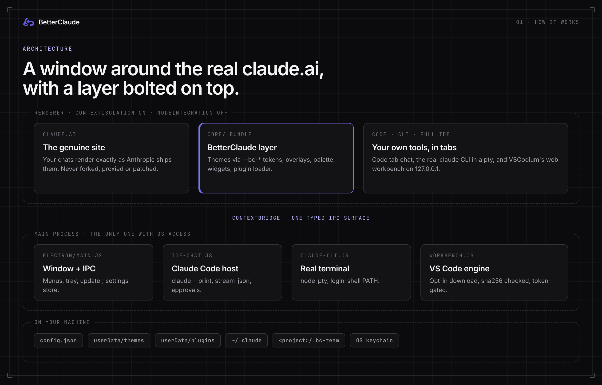

BetterClaude is an Electron `BrowserWindow` pointed at the real `claude.ai`, with a `core/` bundle injected into the page as a preload/content layer. It's the same general shape as a browser extension, packaged as a standalone desktop app. Concretely:

- **`core/claude-dom.js`** reads and reacts to claude.ai's actual DOM (message list, composer, sidebar) rather than replacing it, so the real site keeps rendering your real conversations.
- **`core/theme-engine.js`** and **`core/tokens.js`** theme through CSS custom properties (`--bc-*` variables) laid over claude.ai's own styles, not a hard fork of its stylesheet. That's also why a theme restyles *everything* BetterClaude draws, the embedded terminal included, live and with no reload.
- **`core/plugin-loader.js`** loads `*.claudeplugin.js` files (built-in and yours) into that same page context, sandboxed enough that a broken plugin doesn't take the app down.
- **`electron/main.js`** is the only process with real OS access: spawning the Claude Code CLI, watching files, hitting the GitHub API. The renderer talks to it exclusively through a `contextBridge` (`electron/preload.js` / `electron/code-preload.js`) with `nodeIntegration` off, so page content never gets a raw path to Node or the filesystem.
- **Everything is off unless you turn it on.** Before you touch a single toggle, the app is "claude.ai with better themes". Nothing phones home, collects telemetry, or needs an account beyond the claude.ai login you already have.

<br>

## 02 · The Code tab

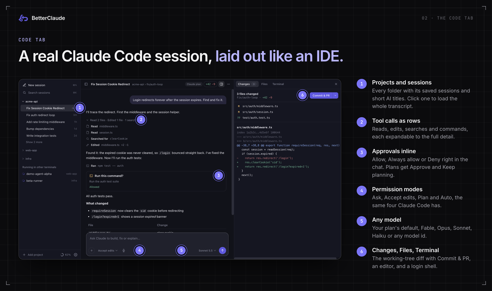

The title bar has one fixed rail of three icons, centred and in the same spot in every mode: **Chat** (claude.ai exactly as Anthropic ships it), **Code** (this workspace) and **CLI** (the plain embedded terminal). claude.ai's own **Code** pill opens the workspace too, instead of leading to a gated route.

The Code tab is laid out like Claude Code's desktop app, and its conversation is a **real Claude Code session on your Claude plan**: the same `claude` you run in a terminal, driven over Claude Code's host protocol (`electron/ide-chat.js`), not a lookalike.

- **Projects and their sessions** share one sidebar: each project folder with its saved sessions nested under it (a short AI title after the first reply), a search box, and status glyphs for working, needs-your-input and unread. Click a saved session and its whole transcript, tool calls included, loads into the chat. Your next message resumes it.
- **One conversation** in the middle: replies as markdown, tool calls as compact rows you can expand ("Edited math.js +1 −1", "Ran npm test"), and **approval cards inline**. That means Allow / Always allow / Deny for a command, option pickers when Claude asks you something, and the plan itself with Approve / Keep planning in Plan mode.
- **Parallel sessions.** Several sessions in several projects can work at once, each in its own `claude` process. A reply Claude starts on its own (say, a background task finished) shows up too.
- **The composer** has Claude Code's permission modes (Ask, Accept edits, Plan, Auto), a model menu (your plan's default, Fable, Opus, Sonnet or Haiku, shown with their real versions such as Opus 5.5 and Haiku 4.5, or any model id), `/` commands plus your prompt library, file attachments, and Stop (Esc). On macOS a **hold-to-talk mic** dictates through a local whisper.cpp.
- **A right panel on demand** (⌘⌥B): **Changes** (the working tree's diff, with Commit & PR through `gh`), **Files** (a tree plus a CodeMirror 6 editor that refuses to clobber a file changed on disk), **Terminal** (a real login shell in the project) and **Extensions**.
- **Usage stats** on the new-session screen (below).
- **Signed out? One click.** If Claude Code's login is missing or expired, the chat says so plainly and offers **Sign in to Claude**, which runs `claude auth login` in the Terminal panel for you.

> [!IMPORTANT]
> **Billing stays yours.** Chats run on your claude.ai login with every API-key and provider override stripped from the environment. If a project's Claude Code settings (or your own) would send a chat to an API key, an auth token or another endpoint, a cloud provider, or an `apiKeyHelper`, it stops before sending anything. Loading your `~/.claude/settings.json` (hooks, plugins and its `env` block) is opt-in under **Settings → Claude Code**.

### Usage stats

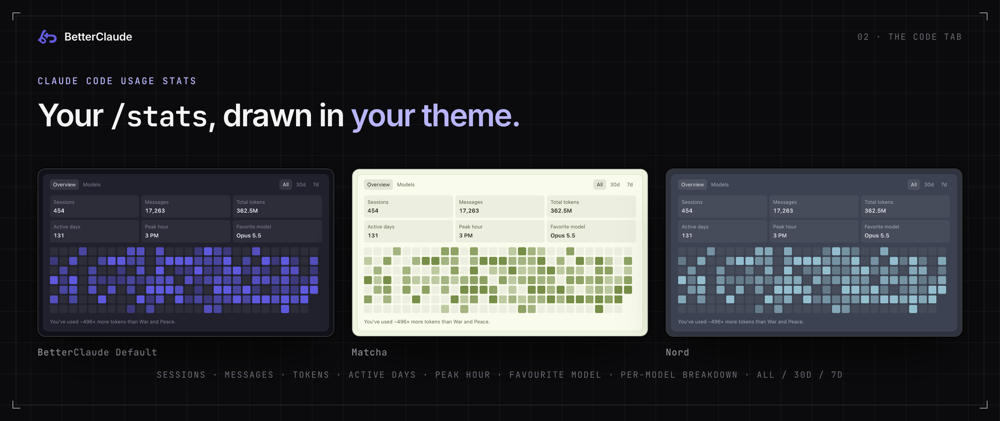

A fresh session opens on Claude Code's own `/stats`: sessions, messages, total tokens, active days, peak hour and favourite model, a day-by-day heatmap, and a **Models** tab with each model's share of your tokens, for **All**, **30d** or **7d**. The numbers come straight from Claude Code (`~/.claude/stats-cache.json` plus your session transcripts), read by `electron/claude-stats.js` in a background utility process. BetterClaude doesn't log anything of its own to produce them. The heatmap and model bars are drawn in your theme's accent colour, so they change with the theme.

A nice side effect of the rail: open a conversation while a Code surface is showing and claude.ai squeezes into the left half of the window, so you can read the conversation and watch the terminal at the same time.

<br>

## 03 · Full IDE

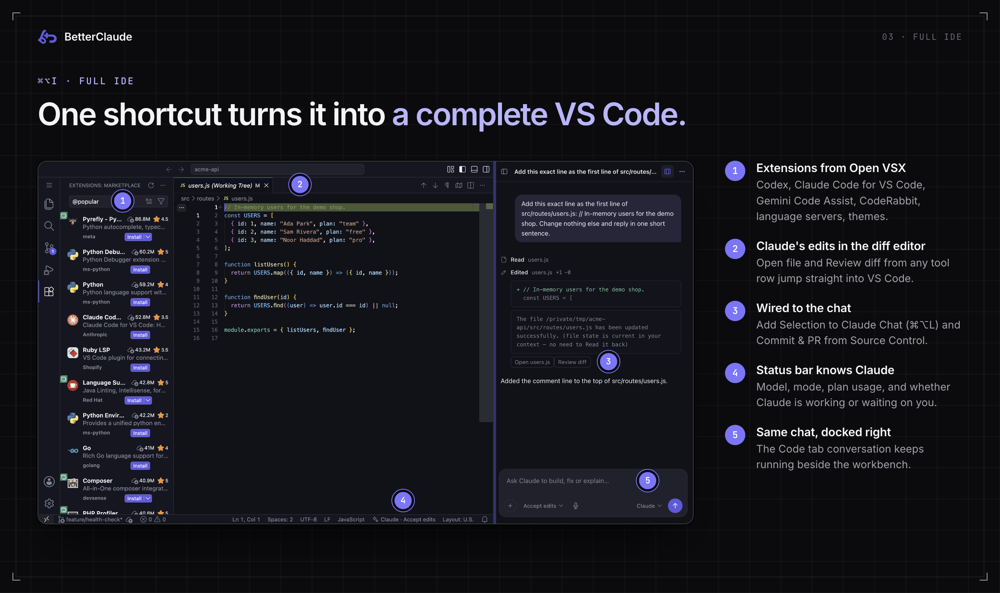

Press **⌘⌥I** (or the layout button in the chat's header) and the Code tab becomes a complete VS Code: a real workbench on the left, the same Claude Code chat on the right. It's VS Code's open-source build, [VSCodium](https://vscodium.com)'s web server, running on your machine. So it has everything VS Code has: explorer, search, source control, editor splits and the diff editor, real terminals, the command palette, keybindings and extensions.

- **Opt-in download.** The first time, a card shows exactly what it will fetch (about 131 MB from VSCodium's GitHub releases), and nothing downloads until you say so. It's checked against VSCodium's published sha256, kept in BetterClaude's data folder, and works offline afterwards. Chat-first stays the default, and each project remembers the layout you leave it in.
- **Extensions from Open VSX**, through VS Code's own Extensions view: Codex, Claude Code for VS Code, Gemini Code Assist, CodeRabbit, language servers, themes. Extensions run in a real Node extension host, so ones built only for desktop VS Code work too. **Settings → Claude Code → Full IDE** can also **import** the extensions you use in VS Code, Cursor, Antigravity or VS Code Insiders (each is reinstalled by id from Open VSX and checked against Open VSX's sha256; nothing is copied out of those editors or written into them), and **install a `.vsix`** you choose.
- **Wired to the chat.** A built-in bridge extension keeps both sides in step. A tool row's **Open file** and **Review diff** open in the editor and VS Code's diff editor. **Add Selection to Claude Chat** (⌘⌥L) puts the selected code in the composer, unsent. The status bar shows the chat's model, mode, plan usage, and whether Claude is working or waiting on you. **Commit & PR** sits in Source Control's title bar, and the workbench follows your BetterClaude theme and code font until you pick another colour theme in it.
- **Walled off.** The server listens on 127.0.0.1 only, behind a secret token that never appears in a URL, a command line or a log. The view has its own storage and runs sandboxed with no preload, so nothing in it (extension webviews included) can reach BetterClaude or claude.ai. It can't navigate or open windows anywhere else, and gets no permission except the clipboard. Extension webviews load from the engine's own files, offline, instead of Microsoft's CDN, and telemetry is off. The server goes away when BetterClaude quits (or crashes), and after ten idle minutes outside the full-IDE layout.
- **Extensions are still extensions.** They run with your user's permissions, exactly as in VS Code, and can see your home folder, other tools' logins included. If you're signed in to the Codex or Claude Code CLI, those extensions start out signed in.
- **What it costs:** about 330 MB of memory with no extensions installed (the server, its extension host and the view) and a few seconds to open. AI extensions add their own CLIs and whatever those start. **Settings → Claude Code → Full IDE** switches back to the lightweight editor, checks for engine updates (warning first if one would disable an installed extension), and uninstalls the engine.

<details>
<summary><b>Without the full IDE: the lightweight Extensions panel</b></summary>
<br>

With the full IDE off or not installed, the Code tab's right panel keeps an **Extensions** tab. It reads what you have installed across **VS Code, Cursor, Antigravity and VS Code Insiders**, searches the [Open VSX registry](https://open-vsx.org) live, and Install unpacks the `.vsix` into the first of those editors it finds on your machine. With an empty search box you get a built-in, hand-curated catalog of about 100 extensions, no network required.

</details>

<br>

## 04 · Models

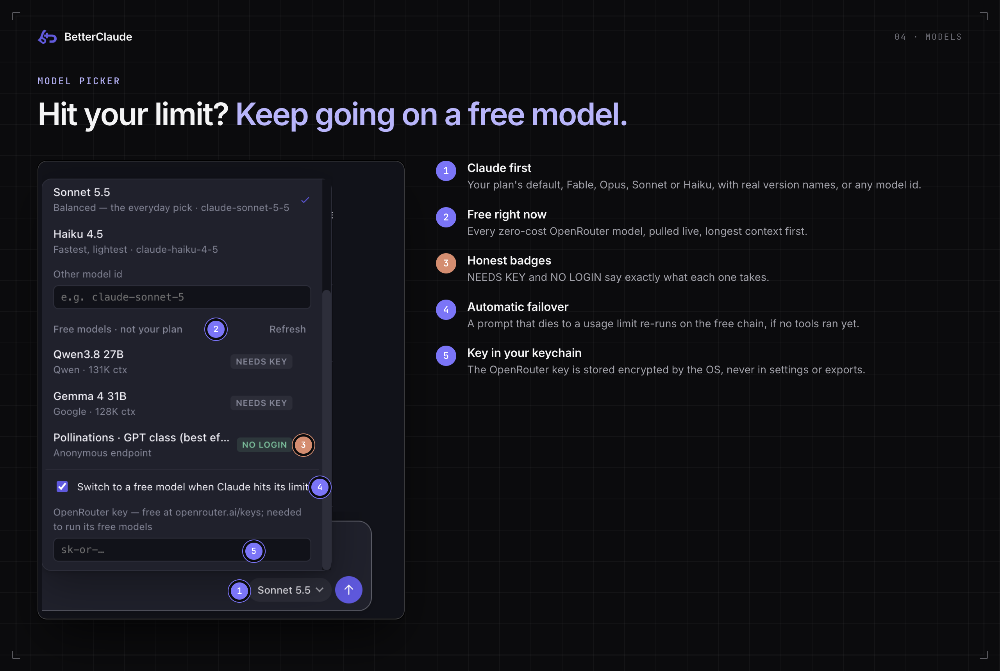

The model picker leads with Claude: your plan's default, Fable, Opus, Sonnet or Haiku with their real version numbers (learned from what Claude Code reports), or any model id you type. Below that is a **"Free right now · OpenRouter"** section: every zero-cost model on OpenRouter, pulled live from their public catalog, longest context first. Then a **"No login needed"** tier that tries a local Ollama first.

There are two ways to use it:

1. **Pick a free model** and chat with it directly, without touching your subscription.
2. **Stay on Claude.** If a prompt dies to a usage limit, the same prompt re-runs on the free chain automatically ("Switch to a free model when Claude hits its limit", on by default). Failover only takes over a turn that hadn't run any tools yet.

OpenRouter's free models need a free key from [openrouter.ai/keys](https://openrouter.ai/keys); paste it into the picker footer. It's stored encrypted in your OS keychain, never in settings or exports. Without one, the chain goes straight to a local Ollama and then a best-effort anonymous endpoint. Requests go from the app straight to the provider you picked. There's no BetterClaude server in the middle, because there is no BetterClaude server.

<br>

## 05 · Team Hub

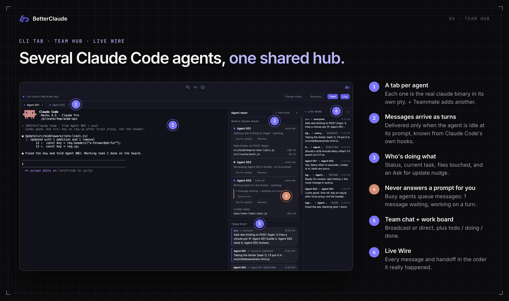

Every session working in the same folder shares a hub at `<project>/.bc-team/`: plain JSON files (roster, messages, task board, work log) that the agents read and write with their ordinary file tools. No server, no ports, nothing to host.

- **The Team sidebar** shows who's doing what (status dots, work-log excerpts, an "Ask for update" nudge, anything waiting to be delivered), a **team chat** feed with per-recipient or broadcast sending, a **work board** (todo / doing / done, assignable), and **Made so far**, a real git summary of everything the team has touched.
- **The Live Wire** is a resizable rail on the right edge streaming every message and handoff in the order it actually happened, even when an agent stamps its message with a made-up time.
- **+ Teammate** spawns another real `claude` session into the same hub. Teammates are named **Agent 001**, **Agent 002**, … and address each other by name. Rename any of them from its Team card (double-click the name, or press Rename); its work and history stay the same, and its old name still resolves.
- **Code-tab chats can join too:** More (⋯) → **Join the agent team**, or **New teammate** for a fresh chat on the team. A teammate's message shows up in the chat as a labelled "Message from …" turn.
- **Session Mesh** (on by default) puts every ordinary CLI tab into the folder's hub too, so two terminals open on one project can already see each other. Turn it off in Settings if you only want explicit teammates to cooperate.
- **Multi-session tabs.** **+** opens another session, every tab keeps its own pty with its own Local/Cloud resume picker, a finished session shows its exit code with Restart / New session / Close tab instead of a dead pane, and changing folder restarts the tab in place.

<details>
<summary><b>How delivery stays safe</b></summary>
<br>

A message is typed into a teammate only when it's idle at its prompt. BetterClaude knows this from Claude Code's own hooks, not by guessing from terminal output. A teammate that's mid-turn, at the folder-trust question, or showing a permission prompt gets the message queued ("1 message waiting, working on a turn") and delivered right after, so a message can never answer a prompt for it. A Code-tab chat's running turn is never interrupted. Esc (CLI) and Stop (Code tab) work as usual, and the next message still arrives.

Messages already in the hub when the app starts are history and are never re-sent. Automatic traffic has a per-agent rate cap, a pause after a long back-and-forth between the same two agents (acting on either resumes it), and duplicate suppression; none of that applies to what *you* send. Bodies are stripped of control characters before they reach a terminal, and every agent is told that teammate messages are information, not authority: a teammate can't grant permissions, approve actions, or override you. The hub writes its own `.bc-team/.gitignore`, so it never lands in a commit.

</details>

<br>

## 06 · Command palette

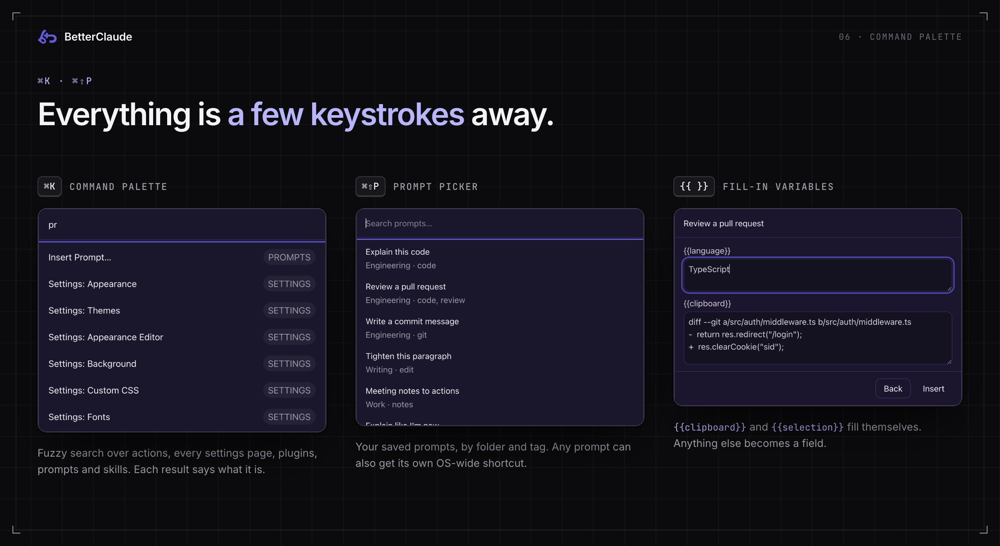

**⌘K** opens one fuzzy-search overlay over app actions, every settings page (it jumps straight to the right section), installed plugins (toggle them inline), Prompt Library entries (insert directly), and both installed and marketplace Skills. Matching runs through a small hand-rolled subsequence scorer (`fuzzyScore` in `core/command-palette.js`), so abbreviations and scattered-letter queries still rank sensibly. Each result carries a group tag (Action, Settings, Plugins, Prompts, Skills) so you know what you're about to trigger. You can add your own commands that flip any setting under **Settings → Command Palette**.

**⌘⇧P** opens the **Prompt picker** (`core/prompt-picker.js`) over your saved prompts. Placeholders like `{{language}}` become fields; `{{clipboard}}` and `{{selection}}` fill themselves. Any single prompt can also be bound to its own **OS-wide** shortcut through Electron's `globalShortcut`, so it fires even when BetterClaude isn't focused. Prompts import and export as JSON and merge by id, so pulling in someone else's library never wipes yours.

<br>

## 07 · Themes

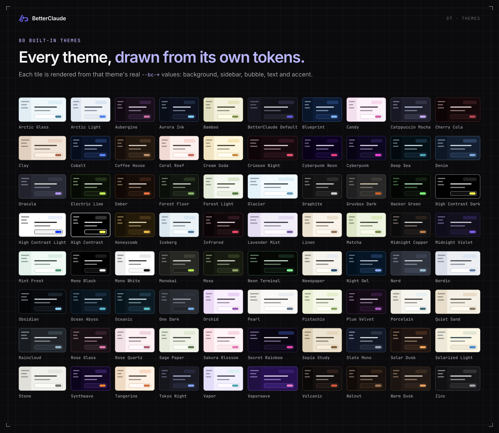

80 built-in themes ship in `themes/*.css`. Each is a plain, readable stylesheet built on the same `--bc-*` token set, so any of them can be copied and tweaked as a starting point for your own. The tiles above aren't mockups: each one is drawn from that theme's real token values.

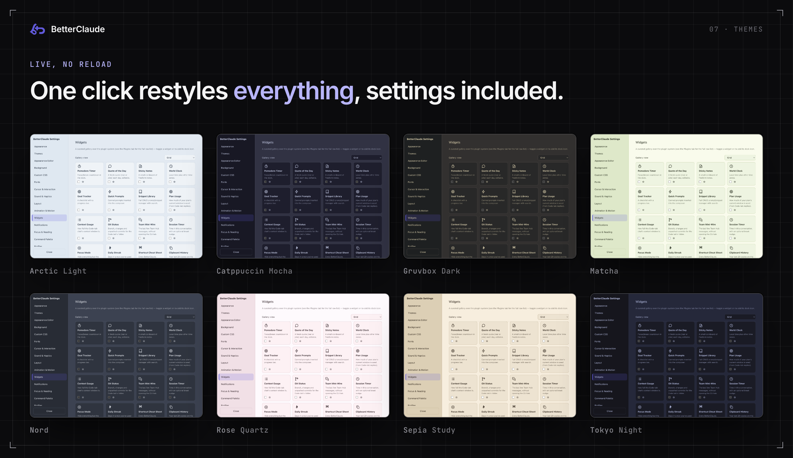

Switching is live and restyles everything BetterClaude draws: claude.ai, overlays, settings, the Code tab and the terminal. On top of picking one outright:

- **Each theme brings its own accent colour**, used for buttons, focus rings, the Code tab's usage heatmap and more. The accent picker under **Settings → Appearance** overrides it until you pick another theme.
- **Favourite** the ones you like so they sort first, hit **Shuffle**, or **Surprise Me** to randomise everything.
- **Automatic switching** between a light and a dark theme on a schedule.
- **Import** a theme from a URL or a local file when someone shares one.
- **Appearance Editor** tunes colours, control size, corner shape and sidebar position without CSS, shows every derived hover / active / disabled token live, and **saves the result as your own named theme** next to the built-in 80.
- **Custom CSS** layers raw CSS on top of whatever theme is active, for anything the editor doesn't cover.

<details>
<summary><b>The full list, grouped by mood</b></summary>
<br>

| Mood | Themes |
| :--- | :--- |
| **Neutrals** | BetterClaude Default, Graphite, Slate Mono, Zinc, Stone, Mono Black, Mono White, Porcelain, Pearl, Linen, Quiet Sand |
| **Dark & terminal** | Dracula, Nord, Nordic, Tokyo Night, Gruvbox Dark, One Dark, Monokai, Night Owl, Obsidian, Hacker Green, Neon Terminal, Crimson Night |
| **High contrast** | High Contrast, High Contrast Dark, High Contrast Light |
| **Vibrant & neon** | Cyberpunk, Cyberpunk Neon, Synthwave, Vapor, Vaporwave, Infrared, Electric Lime, Secret Rainbow |
| **Cool & aquatic** | Arctic Glass, Arctic Light, Glacier, Iceberg, Deep Sea, Ocean Abyss, Oceanic, Cobalt, Denim, Blueprint, Mint Frost, Raincloud |
| **Warm & earthy** | Bamboo, Moss, Forest Floor, Forest Light, Matcha, Pistachio, Sage Paper, Walnut, Coffee House, Ember, Tangerine, Honeycomb, Warm Dusk, Solar Dusk, Clay, Volcanic |
| **Soft & pastel** | Sakura Blossom, Cherry Cola, Coral Reef, Cream Soda, Rose Glass, Rose Quartz, Lavender Mist, Orchid, Plum Velvet, Candy, Aubergine |
| **Reading & paper** | Sepia Study, Newspaper, Solarized Light, Catppuccin Mocha, Aurora Ink, Midnight Copper, Midnight Violet |

</details>

<br>

## 08 · Settings

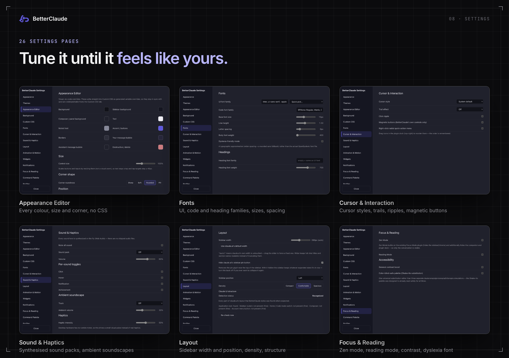

Every setting lives in one `electron-store`-backed JSON file, and none of them needs a restart. Open Settings with **⌘,**, from the palette, or from the tray. The CLI tab has its own smaller settings (appearance, fonts, Claude Code and Session Bundles). Here's every page:

<details open>
<summary><b>All 26 settings pages</b></summary>
<br>

| Page | What's there |
| :--- | :--- |
| **Appearance** | The master switch (off = stock claude.ai), accent colour, export / import your whole setup as one JSON file, update checks |
| **Themes** | The 80 themes, favourites, Shuffle, Surprise Me, import from URL or file, scheduled light / dark switching |
| **Appearance Editor** | Every palette colour, control size, corner shape (Sharp → Pill), sidebar position, save as new theme, a live table of every derived token |
| **Background** | Background type, a rotating pool of saved backgrounds, frosted-glass panels |
| **Custom CSS** | A CodeMirror editor whose CSS layers on top of the active theme |
| **Fonts** | UI, code and heading families, base size, line height, letter spacing, weight, a dyslexia-friendly mode |
| **Cursor & Interaction** | Cursor style, trails (sparkles, particles, comet), click ripple, magnetic buttons, a right-click quick-action menu |
| **Sound & Haptics** | Synthesised sound packs (no audio files shipped), per-sound toggles, ambient soundscapes, haptic intensity |
| **Layout** | Sidebar width and position, hide claude.ai's sidebar pin, density, and a check of which parts of claude.ai's layout were recognised |
| **Animation & Motion** | Speed, transition style, easing, a reduce-motion override, confetti, parallax, seasonal decorations |
| **Widgets** | The curated widget gallery (see [Widgets](#09--widgets--plugins)) |
| **Notifications** | Banner style, quiet hours, per-category toggles, and the **Smart Notification Digest** |
| **Focus & Reading** | Zen mode, reading mode, contrast boost, a colour-blind-safe palette |
| **Command Palette** | Custom commands that set any setting to a value |
| **Profiles** | Save your whole setup under a name and swap in one click, plus A/B compare two profiles |
| **Automations** | Curated "if this, then that" toggles: Zen mode mutes sound, achievements burst confetti, Focus mode pauses ambience |
| **Personality** | The desktop buddy, an in-window companion, streaks and achievements |
| **Plugins** | The raw plugin list with on/off toggles, and **Open Plugins Folder** |
| **Team Sync** | Shared plugins and themes from a git repo (see [Productivity modules](#10--productivity-modules)) |
| **Session Bundles** | Export / import Claude Code sessions as `.bcbundle` files. Lives in the **CLI tab's** settings, since its transcript viewer uses that tab's terminal renderer |
| **Skill Marketplace** | Browse and download Claude skills from GitHub |
| **Prompt Library** | Your saved prompts, folders, tags and per-prompt shortcuts |
| **File Watcher** | Keep a local file synced into the composer |
| **Clipboard Bridge** | End-to-end encrypted clipboard sync across devices |
| **Claude Code** | The CLI tab, Session Mesh, terminal font size, the `claude` path, loading `~/.claude` settings, Code tab chat options, and the **Full IDE** controls |
| **Keyboard Shortcuts** | Rebind the app-level shortcuts |

</details>

<br>

## 09 · Widgets & plugins

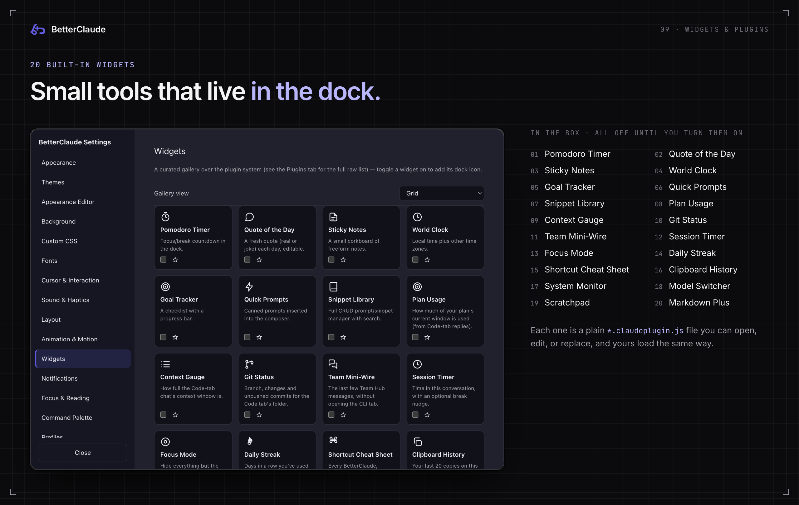

Twenty plugins ship in the box, all **off until you turn them on**. Each is a plain `*.claudeplugin.js` file in `plugins/` that you can open, read, edit or replace. There's no compiled or minified plugin format to fight with.

| Plugin | What it does |
| :--- | :--- |
| **Focus Mode** | Strips everything that isn't the active conversation (sidebar, nav chrome, the works), toggled in and out instantly |
| **Goal Tracker** | A running checklist with a progress bar, so what you're actually trying to do stays visible |
| **Markdown Plus** | Extra Markdown rendering on top of claude.ai's own, in the composer and in replies |
| **Pomodoro Timer** | Focus / break countdown in the dock |
| **Quick Prompts** | One-click buttons for the prompts you type constantly |
| **Quote of the Day** | A fresh quote (real or joke) each day, and you can add your own |
| **Snippet Library** | Reusable text snippets with search, for shorter and more disposable bits than the Prompt Library |
| **Sticky Notes** | A small corkboard of freeform notes that persists across sessions |
| **World Clock** | Local time plus other time zones |
| **Plan Usage** | How much of your plan's current usage window is spent, from the reading Claude Code reports with each Code-tab reply. Never scraped, stored or sent anywhere. |
| **Context Gauge** | How full the Code-tab chat's context window is, with a nudge to `/compact` past 80% |
| **Git Status** | Branch, changed files, lines added / removed and unpushed commits for the Code tab's folder |
| **Team Mini-Wire** | The last few Team Hub messages in a dock card, without opening the CLI tab |
| **Session Timer** | Time in the current conversation, with an optional 25 / 50 / 90-minute break nudge |
| **Daily Streak** | Days in a row you've used Claude |
| **Shortcut Cheat Sheet** | Your BetterClaude bindings plus the Code-tab and Claude Code keys, in one card |
| **Clipboard History** | Your last 20 copies on the page, one click to copy again. Memory only, gone when you quit. |
| **System Monitor** | Machine load and memory, plus BetterClaude's own memory and CPU |
| **Model Switcher** | Set the Code tab's model (Default / Fable / Opus / Sonnet / Haiku, with versions) from the dock |
| **Scratchpad** | One big plain-text pad that survives restarts |

### Write your own

Drop a file into the plugins folder (**Settings → Plugins → Open Plugins Folder**) and it shows up in the list, ready to toggle like any other. Built-in and custom plugins load the same way, from the same `userData/plugins` directory.

```js
// hello.claudeplugin.js
module.exports = {
  name: "Hello",
  version: "1.0.0",

  onLoad(api) {
    api.registerSetting("count", 0); // persisted per plugin

    this.button = api.mountToolbarButton({
      icon: `<svg viewBox="0 0 24 24"><circle cx="12" cy="12" r="5"/></svg>`,
      label: "Say hello",
      onClick: () => {
        const count = api.getSetting("count") + 1;
        api.setSetting("count", count);
        api.insertIntoComposer(`Hello, Claude! (#${count})`);
        api.notify("Inserted a greeting.");
      },
    });
  },

  onUnload() {},
};
```

The `api` object also offers `injectCSS` / `removeCSS`, `getTheme()`, `query` / `queryAll` for claude.ai's DOM, `widgetData(kind)` for Code-tab readings like plan usage or git status, and `setCodeModel(model)`. Style with the `--bc-*` tokens (`var(--bc-accent)`, `var(--bc-bg-elevated)`, …) and your plugin follows every theme for free. The best reference is `core/plugin-loader.js` and the twenty built-ins in `plugins/`. This is also exactly where Team Sync writes, so a plugin shared through a team repo and one you wrote yourself look the same to the loader.

<br>

## 10 · Productivity modules

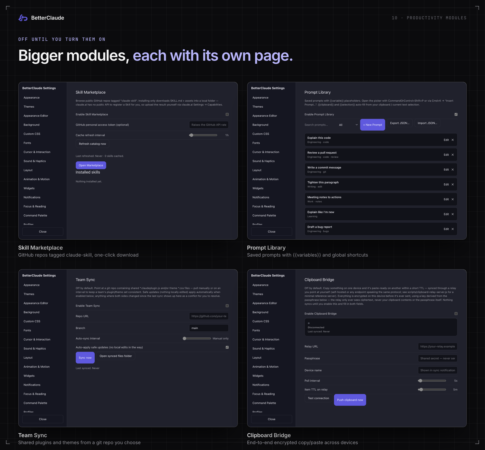

Bigger features with their own settings page, each independently toggleable and persisted in the same settings file as everything else.

| Module | Default | One line |
| :--- | :---: | :--- |
| **Command Palette** | On | ⌘K over everything, [above](#06--command-palette) |
| **Prompt Library** | Off | Saved prompts with `{{variables}}` and global shortcuts |
| **Skill Marketplace** | Off | GitHub repos tagged `claude-skill`, one-click download |
| **File Watcher Sync** | Off | A local file kept in sync inside the composer |
| **Team / Shared Plugin Sync** | Off | Plugins and themes from a git repo you choose |
| **Session Bundles** | Manual | Export / import a session's transcript and diff, with mandatory secret redaction |
| **Clipboard Bridge** | Off | End-to-end encrypted copy / paste across devices |
| **Smart Notification Digest** | Off | Batch "it worked" notifications, never errors |
| **Claude Code usage stats** | Code tab | Claude Code's own `/stats`, on the new-session screen |

<details>
<summary><b>Skill Marketplace</b></summary>
<br>

Browses public GitHub repos tagged `claude-skill` through the GitHub Search API (add a personal access token in Settings for a higher rate limit). **Install** downloads a skill's `SKILL.md` plus any bundled assets straight into `userData/skills/<id>/`. It stops there on purpose: claude.ai has no public API for registering a Skill, so BetterClaude doesn't try to upload it for you. You take the last step yourself via claude.ai → Settings → Capabilities. What it saves you is hand-cloning repos and hunting for the right file. **Updating** works the same way: re-running Install over an existing id re-downloads from the repo's current `main`. The catalog UI lives in `core/skill-marketplace.js` and opens from ⌘K → "Open Skill Marketplace"; downloads and search are `skills:*` IPC handlers in `electron/main.js`.

</details>

<details>
<summary><b>Native File Watcher Sync</b></summary>
<br>

Points at a local file, watches it with `chokidar` in the main process, and keeps a labelled fenced-code-block copy of its contents in the composer (`core/file-sync-indicator.js`). This deliberately does **not** fake claude.ai's file-upload button: the synced content is real inserted text, so what Claude sees is exactly what's in your composer. "Auto-reattach" only replaces that same block inside a message you haven't sent yet. Once a message is sent, a file that changes afterwards is flagged stale with a one-click re-insert, never silently rewritten.

</details>

<details>
<summary><b>Team / Shared Plugin Sync</b></summary>
<br>

Points at a git repo containing shared `*.claudeplugin.js` and/or theme `*.css` files. `electron/team-sync.js` shells out to your system `git` (clone once, then `fetch` + hard reset on every later sync, with no bundled JS git library) into `userData/team-sync/<repo-slug>/`, then copies matched files into the same `userData/plugins` / `userData/themes` folders a hand-added plugin or theme lives in. Sync manually with **Sync now** or on an interval.

Conflicts are hash-based: a per-file manifest remembers what was last applied, so a sync can tell "the repo changed" from "you edited your local copy". A file where **both** changed shows up as a conflict with an inline diff and a **Keep mine / Take theirs** choice. Anything non-conflicting applies automatically when Auto-apply is on.

</details>

<details>
<summary><b>Session Bundles</b></summary>
<br>

Share what actually happened in a Claude Code session, not just the diff. Export packs your local session transcripts (read straight off disk, the same files the `claude` CLI wrote) plus an optional `git diff` into a `.bcbundle` zip. Every session is scanned for API keys, tokens and other secrets before it can be exported. A flagged session has to be redacted or excluded first, and there's no way to skip that check. Import shows the bundle's sessions and diff, with **Resume from here**. Nothing here reads from or sends to claude.ai. The format is documented in [docs/session-bundle-format.md](docs/session-bundle-format.md).

</details>

<details>
<summary><b>Cross-Device Clipboard Bridge</b></summary>
<br>

Copy something on one device and it's paste-ready on another within a short TTL. It syncs through a relay *you* point it at. `scripts/clipboard-relay-server.js` is a minimal self-hostable reference implementation:

```bash
npm run clipboard-relay
# or
node scripts/clipboard-relay-server.js --port 8787
```

Any HTTP endpoint implementing the same tiny `POST /put` / `GET /pull` / `GET /health` protocol works as a drop-in replacement. Everything is end-to-end encrypted before it leaves your machine: `core/clipboard-bridge.js` derives an AES-GCM key from a shared passphrase via PBKDF2, so the relay only ever sees ciphertext and a one-way channel id, never plaintext and never the passphrase. Nothing syncs until a relay URL **and** a passphrase are set and the toggle is on. Settings always shows a live connection state (Disconnected / Connecting / Connected / Error), and every synced item fires a notification, so it's never silently reading or writing your clipboard.

</details>

<details>
<summary><b>Smart Notification Digest</b></summary>
<br>

Batches routine background-completion notifications (a Team Sync file applied, a clipboard item synced, a skill finished installing) into one periodic native OS notification instead of a toast per event. Failures are exempt: `notify()` in `electron/preload.js` has an `urgent` flag that shows immediately, as both an in-page toast and a native notification, regardless of digest state. The digest only ever delays "it worked" noise. It never delays or hides an error.

</details>

<details>
<summary><b>Embedded Claude Code window (the CLI tab)</b></summary>
<br>

Opens your real, already-installed Claude Code CLI inside a BetterClaude-owned window instead of handing you off to Terminal. Reach it from the tray, **File → Open Claude Code** / **Open Claude Code in Folder…**, **⌘⇧K**, the title-bar rail, or by launching with `--code`.

The relationship is the one `lazygit` has with `git`. `electron/claude-cli.js` resolves the `claude` executable the way a login shell would (PATH first, then the usual install locations, because a Dock-launched app inherits a stripped-down PATH) and spawns it in a real pseudo-terminal via `node-pty`; `ui/code-window/terminal.js` renders it with `xterm.js`. Nothing about the CLI is reimplemented, wrapped or intercepted: it's the authentic binary, and BetterClaude supplies only the window around it.

The renderer runs with `nodeIntegration: false`. Every byte of pty output crosses exactly one `contextBridge` surface, the only thing ever written to the child's stdin is your own keystrokes, terminal output is never parsed to auto-trigger anything, and no auth token, session file or credential is read anywhere along that path. Closing the tab kills the child process. Because the terminal reads the same `--bc-*` variables as everything else, switching theme restyles it live without disturbing the running session.

</details>

Full technical detail on every module (exact file paths, IPC handler names, what's persisted where) is in [docs/DESKTOP-APP.md](docs/DESKTOP-APP.md).

<br>

## 11 · Privacy

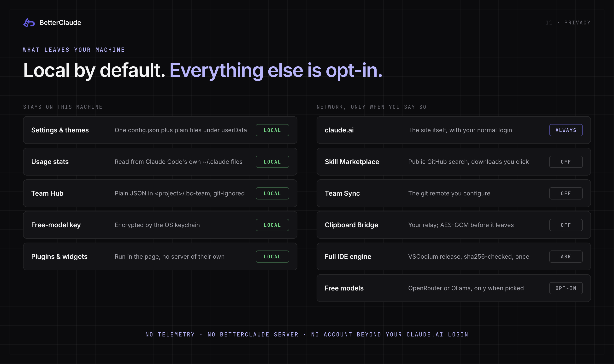

- **Nothing that reaches outside your machine is on by default.** Skill Marketplace, Team Sync and Clipboard Bridge (the modules that talk to something other than claude.ai) all ship **off** and stay off until you enable them **and** supply the endpoint yourself. The full IDE engine downloads only after you confirm its card. Free models are only contacted when you pick one, or when failover is on and Claude hits a limit.
- **Local data stays local.** Usage stats are read from Claude Code's own files, with only a small cache under `userData/`. Skills, plugins and themes are plain files under the same tree. None of it is uploaded anywhere by BetterClaude.
- **Anything that does leave is scoped to what you asked for.** Clipboard Bridge encrypts before a relay sees a byte. Skill Marketplace reads public GitHub search results and the repos you install. Team Sync only pulls from the exact remote you configured.
- **No hidden layer.** Turning off every module leaves a plain themed wrapper around claude.ai. Nothing always-on runs underneath the visible toggles.

<br>

## 12 · Buddies & the little stuff

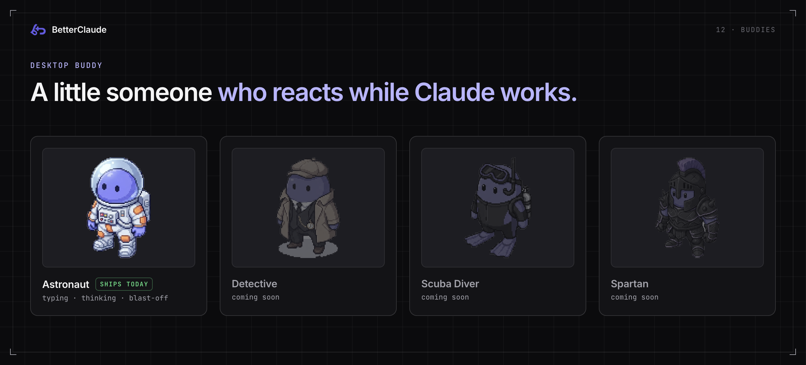

**The desktop buddy** is a small animated companion that sits on your desktop while you work (**Settings → Personality**, off by default). It watches what's actually happening and switches clips as Claude goes from idle to typing to thinking, with a blast-off when a reply lands, instead of looping one animation. **Astronaut** ships today; **Detective**, **Scuba Diver** and **Spartan** are drawn and waiting for their animation pass (`core/buddies.js` is the registry).

Plus a handful of things that don't need their own section:

- **Snake, while you wait.** `ui/mini-game/snake.js` pops a small Snake board into the corner while Claude is generating, and it disappears the moment the answer lands. A setting controls how long a response has to run before it shows, so quick replies never trigger it. The CLI tab has its own Snake that reacts to real terminal activity.
- **Sound effects** for the moments that deserve them (`core/sound-engine.js`), synthesised on the fly, each individually optional.
- **Motion and interaction touches** throughout (`core/interaction-fx.js`, `core/motion-fx.js`): the kind of detail that's easy to miss and hard to unsee.
- **A weather widget** (`core/weather.js`), if you want one more small thing in the corner.
- **A built-in diff viewer** (`core/diff-viewer.js`) for a real side-by-side comparison instead of a diff as flat text.
- **Overlay occlusion handling** (`core/overlay-occlusion.js`): BetterClaude's overlays step aside when claude.ai opens one of its own modals, and vice versa, so the two layers never fight over the same click.
- **Always on top** (⌘⇧T) for keeping Claude above everything else.

<br>

## ⌨️ Keyboard shortcuts

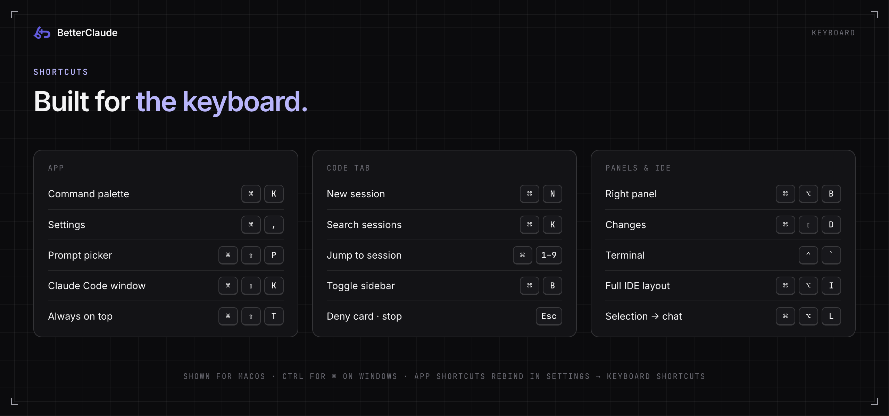

| Shortcut | Action | Where |
| :--- | :--- | :--- |
| <kbd>⌘</kbd> <kbd>K</kbd> | Command palette | App |
| <kbd>⌘</kbd> <kbd>,</kbd> | Settings | App |
| <kbd>⌘</kbd> <kbd>⇧</kbd> <kbd>P</kbd> | Prompt picker | App |
| <kbd>⌘</kbd> <kbd>⇧</kbd> <kbd>K</kbd> | Open the Claude Code window | App |
| <kbd>⌘</kbd> <kbd>⇧</kbd> <kbd>T</kbd> | Always on top | App |
| <kbd>⌘</kbd> <kbd>N</kbd> | New session | Code tab |
| <kbd>⌘</kbd> <kbd>K</kbd> | Search sessions | Code tab |
| <kbd>⌘</kbd> <kbd>1</kbd>–<kbd>9</kbd> | Jump to a session | Code tab |
| <kbd>⌘</kbd> <kbd>B</kbd> | Toggle the sidebar | Code tab |
| <kbd>⌘</kbd> <kbd>⇧</kbd> <kbd>M</kbd> | Permission mode menu | Code tab |
| <kbd>Esc</kbd> | Close a menu, deny a pending card, or stop | Code tab |
| <kbd>⌘</kbd> <kbd>⌥</kbd> <kbd>B</kbd> | Right panel | Code tab |
| <kbd>⌘</kbd> <kbd>⇧</kbd> <kbd>D</kbd> | Changes panel | Code tab |
| <kbd>⌃</kbd> <kbd>`</kbd> | Terminal panel | Code tab |
| <kbd>⌘</kbd> <kbd>⌥</kbd> <kbd>I</kbd> | Toggle the full IDE layout | Code tab |
| <kbd>⌘</kbd> <kbd>⌥</kbd> <kbd>L</kbd> | Add selection to Claude chat | Full IDE |

On Windows, use <kbd>Ctrl</kbd> for <kbd>⌘</kbd> and <kbd>Alt</kbd> for <kbd>⌥</kbd>. The app-level shortcuts can be rebound in **Settings → Keyboard Shortcuts**.

<br>

## 🛠 Building from source

```bash
git clone https://github.com/ara-mkr/BetterClaude.git
cd BetterClaude
npm install
npm start        # build the core bundle and launch Electron
```

`npm run dev` does the same with a file watcher that rebuilds the core bundle as you edit.

<details>
<summary><b>Packaging installers</b></summary>
<br>

Packaged builds go through [electron-builder](https://www.electron.build/), configured in the `build` field of `package.json`:

```bash
npm run build:mac         # macOS: arm64 + x64, .dmg + .zip
npm run build:mac:arm64   # macOS: arm64 only
npm run build:mac:intel   # macOS: x64 only
npm run build:win         # Windows: x64 NSIS installer (.exe)
npm run build:all         # everything above in one run
```

macOS output (`.dmg` / `.zip`) has to be built on a Mac, since Apple's tools (`hdiutil`, `codesign`) aren't available elsewhere. The Windows NSIS installer builds cross-platform from any host, because electron-builder bundles its own NSIS tooling (no Wine needed).

Every build script runs `build:core` first (the esbuild bundle step), so a package never ships a stale bundle. Output lands in `dist/`:

- `dist/BetterClaude-<version>-arm64.dmg` + `.zip`: macOS, Apple Silicon
- `dist/BetterClaude-<version>-x64.dmg` + `.zip`: macOS, Intel
- `dist/BetterClaude Setup <version>.exe`: Windows installer (NSIS; lets the user pick an install directory and adds desktop + Start Menu shortcuts)

These builds are **not signed with a Developer ID** or a Windows code-signing certificate yet. macOS shows a Gatekeeper warning and Windows a SmartScreen prompt (see [Quick install](#-quick-install)). To ship without those warnings, add signing identities to the `mac` / `win` build config plus the matching `CSC_LINK` / `CSC_KEY_PASSWORD` env vars.

</details>

<details>
<summary><b>Releasing & auto-update</b></summary>
<br>

Updates are served straight from **GitHub Releases**; there's no backend server. `build.publish` in `package.json` points `electron-updater` at the repo, electron-builder writes a `latest-mac.yml` / `latest.yml` feed next to the release artifacts, and the running app polls that feed directly.

In the app, it checks for updates about 5 seconds after launch (skippable under **Settings → Appearance → Updates**), plus on demand from that section or **Help → Check for Updates…**. Nothing downloads automatically and nothing installs on quit; both steps always take an explicit click. An available update raises a dismissible banner; **Later** suppresses just that version. Background check failures stay quiet (visible in Settings), while a hand-triggered check always surfaces an error with an **Open Releases** fallback.

**Signing limits how far auto-update can go today.** On macOS, `electron-updater` verifies the downloaded build's signature against the running app before installing, so an unsigned build downloads and then fails to install. Until a Developer ID certificate and notarization are set up, macOS users update by grabbing the new `.dmg` (which is why every update failure offers **Open Releases**). Windows auto-update **does** work unsigned via NSIS, with a SmartScreen prompt on install.

To cut a release:

```bash
npm version patch            # or minor / major; writes package.json and the vX.Y.Z tag
git push && git push --tags  # the tag must be vX.Y.Z
GH_TOKEN=<token with repo scope> npm run build:core && \
  npx electron-builder --mac --arm64 --x64 --win --x64 --publish always
```

The release is created as a **draft**. The notes you add before publishing are exactly what the in-app "what's new" banner shows, as plain text capped at 160 characters. Windows builds are also produced by the `release-windows` GitHub Actions workflow.

</details>

<details>
<summary><b>Project layout</b></summary>
<br>

```text
core/          The injected layer: theme engine, tokens, palette, overlays, plugin loader, widgets
ui/            Settings panel, title bar, the Code tab (ide-*), CLI tabs, mini-games
electron/      Main process: window, IPC, Claude Code host, pty, VS Code engine, team sync
themes/        The 80 built-in themes, one readable .css file each
plugins/       The 20 built-in *.claudeplugin.js widgets
resources/     Processed buddy assets and other packaged resources
scripts/       Build helpers, DOM / layout audits, the clipboard relay
docs/          Desktop app internals, ADRs, the .bcbundle format, release notes
```

</details>

<br>

## ❓ FAQ

<details>
<summary><b>Is this allowed? Does it touch my account?</b></summary>
<br>

BetterClaude loads the genuine claude.ai in a window and styles it locally, the way a browser extension would. It doesn't proxy your traffic, store your login, scrape your conversations, or call any private API. The Code and CLI tabs run the official Claude Code CLI you installed yourself. It is an independent project and is **not affiliated with Anthropic**.

</details>

<details>
<summary><b>The Code tab says it can't find <code>claude</code>.</b></summary>
<br>

Install the [Claude Code CLI](https://docs.claude.com/en/docs/claude-code). If it's installed but signed out, the Code tab offers **Sign in to Claude** right in the chat. If it's installed somewhere unusual, set its path under **Settings → Claude Code**. BetterClaude resolves `claude` the way a login shell would, so anything on your shell's PATH should be found even when the app is launched from the Dock.

</details>

<details>
<summary><b>Will a Code-tab chat ever bill an API key instead of my plan?</b></summary>
<br>

Not silently. Chats run on your claude.ai login with API-key and provider overrides stripped from the environment, and a pre-flight check stops the chat if any Claude Code settings file would route it to an API key, auth token, custom endpoint, cloud provider or `apiKeyHelper`. See [The Code tab](#02--the-code-tab).

</details>

<details>
<summary><b>claude.ai changed and something looks off.</b></summary>
<br>

BetterClaude reads claude.ai's live DOM, so a redesign can occasionally misplace a styled element. **Settings → Layout** shows which parts of the page were recognised. You can always flip the master switch in **Settings → Appearance** to get stock claude.ai back instantly, and please [open an issue](https://github.com/ara-mkr/BetterClaude/issues) so the fix makes the next release.

</details>

<details>
<summary><b>How do I move my setup to another machine?</b></summary>
<br>

**Settings → Appearance → Export settings…** writes your whole setup (theme, layout, plugin data, shortcuts) as one JSON file; **Import settings…** on the other machine restores it. For a team, put plugins and themes in a git repo and point **Team Sync** at it.

</details>

<details>
<summary><b>How do I uninstall it?</b></summary>
<br>

Delete the app. Nothing was installed into claude.ai or your account. Its settings, themes, plugins and the optional VS Code engine live in BetterClaude's own user-data folder, which you can delete too. To remove just the full IDE engine, use **Settings → Claude Code → Full IDE**.

</details>

<br>

## 🤝 Contributing

Issues and pull requests are welcome. If you're adding a plugin or a theme, start from an existing one in `plugins/` or `themes/`: both formats are small enough to copy and adapt rather than build from scratch. For anything bigger, [docs/DESKTOP-APP.md](docs/DESKTOP-APP.md) maps every module to its files and IPC handlers, and [docs/ADR-0001-full-ide-workbench.md](docs/ADR-0001-full-ide-workbench.md) explains how the full IDE was designed.

## 📄 License

MIT, see [LICENSE](LICENSE).

<br>

<div align="center">
<sub>BetterClaude is an independent project and is not affiliated with, endorsed by, or sponsored by Anthropic. Claude and claude.ai are trademarks of Anthropic, PBC.</sub>
</div>
